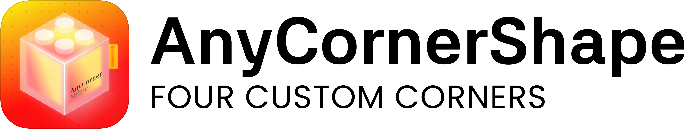

<p align="left">
  
</p>

**English** · [繁體中文](README.zh-Hant.md)

A lightweight SwiftUI component that lets you set the corner radius of each of a rectangle's four corners independently.

```swift
AnyCornerShape(topLeading: 24, topTrailing: 20, bottomLeading: 12, bottomTrailing: 0)   // as a Shape

Rectangle().anyCornerShape(topLeading: 24, bottomTrailing: 16)                           // as a modifier
```

[](https://swift.org)
[](https://swift.org/package-manager)

[](LICENSE)

---

## Use Cases

Suitable for any UI that needs asymmetric corners: cards, popovers, chat bubbles, tabs, bottom sheets, avatar clipping, and more. Any SwiftUI view that needs per-corner radius control can use this component.

## Features

- Each of the four corners has an independent radius.
- Works both as a `Shape` and as a `View` modifier, with a style consistent with SwiftUI's native shapes.
- Supports `RoundedCornerStyle` (`.continuous` squircle / `.circular`), with automatic fallback to `.circular` on older systems.
- Conforms to `InsettableShape`, so `strokeBorder` and inset drawing work out of the box.
- Supports SwiftUI animation interpolation via `animatableData`.
- Automatic proportional radius scaling (CSS `border-radius` style) so radii never exceed edge lengths and the shape never breaks.
- A convenience initializer/modifier for setting all four corners to the same radius.
- Pure Swift, zero third-party dependencies; supports Swift 6 strict concurrency.
- Cross-platform: iOS, macOS, tvOS, watchOS, visionOS.

## Installation

### Swift Package Manager

In Xcode choose `File > Add Packages…` and paste the repository URL.

Or in `Package.swift`:

```swift
dependencies: [
    .package(url: "https://github.com/jackcring/AnyCornerShape.git", from: "1.0.0")
],
targets: [
    .target(
        name: "YourApp",
        dependencies: ["AnyCornerShape"]
    )
]
```

Minimum deployment targets:

| Platform | Min   |
| -------- | ----- |
| iOS      | 13.0  |
| macOS    | 10.15 |
| tvOS     | 13.0  |
| watchOS  | 6.0   |
| visionOS | 1.0   |

## Quick Start

```swift
import AnyCornerShape
import SwiftUI

struct ContentView: View {
    var body: some View {
        Text("Hello")
            .padding()
            .background(.blue)
            .foregroundStyle(.white)
            .anyCornerShape(topLeading: 16, bottomTrailing: 16)
    }
}
```

When all four corners share the same radius, use the shorthand:

```swift
Rectangle()
    .fill(.green)
    .frame(width: 120, height: 120)
    .anyCornerShape(20)
```

Use it directly as a `Shape` when you need to fill or stroke it:

```swift
AnyCornerShape(topLeading: 24, topTrailing: 20, bottomLeading: 12, bottomTrailing: 0)
    .fill(.blue)
    .frame(width: 200, height: 100)
```

## FAQ

**Q: The `.continuous` style has no effect.**

A: `.continuous` (squircle) only applies on iOS 16+ / macOS 13+ / tvOS 16+ / watchOS 9+ / visionOS 1+. Older systems automatically fall back to the `.circular` standard arc.

**Q: Corner positions look wrong in RTL layouts.**

A: Parameters are treated as physical positions (`topLeading` is the top-left corner). To mirror in RTL, swap the leading and trailing values yourself.

**Q: What happens if a radius is too large?**

A: The component clamps each radius to half of the shortest edge and proportionally scales adjacent corners, so the shape never breaks.

**Q: Can I draw a border with independent corners?**

A: Yes. `AnyCornerShape` conforms to `InsettableShape`, so `strokeBorder` works and stays aligned to the inset edges.

## Contributing

PRs and issues are welcome. Before submitting, please run:

```bash
swift build
swift test
```

## License

MIT License. See [LICENSE](LICENSE) for details.

## Author

**Jc** © [jackcirng.com](https://jackcirng.com)
